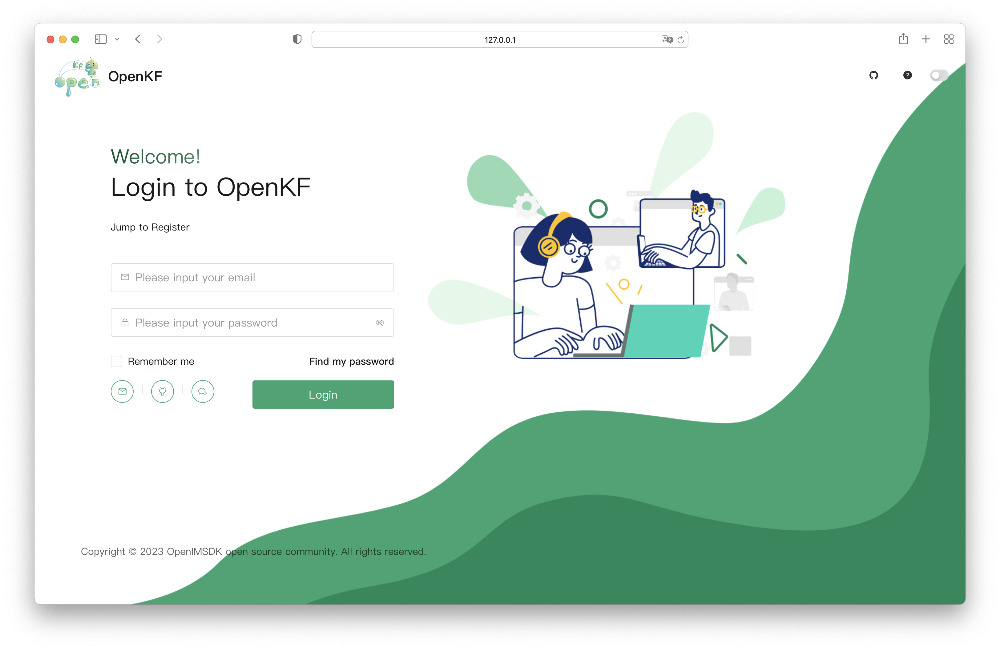
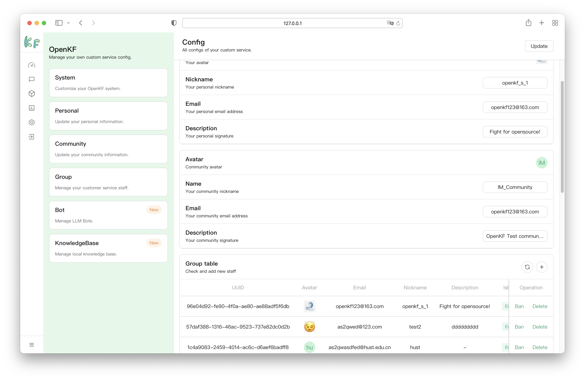
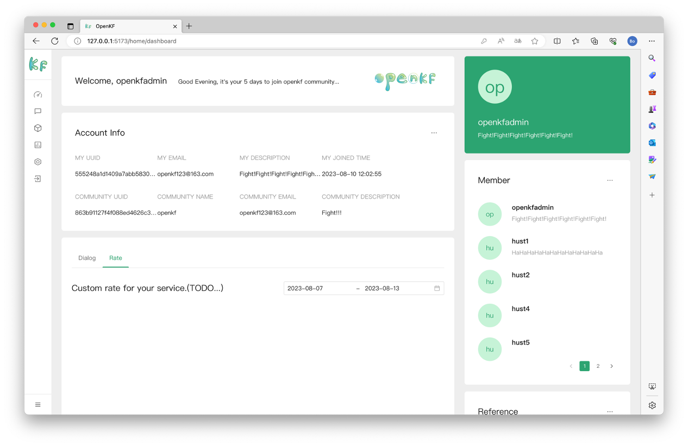
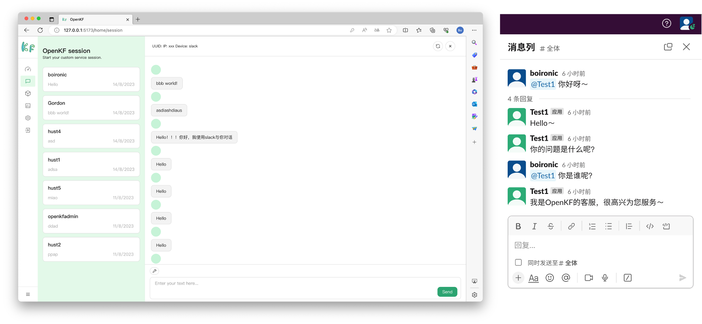
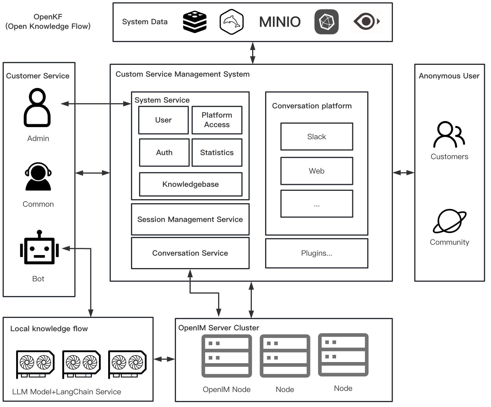
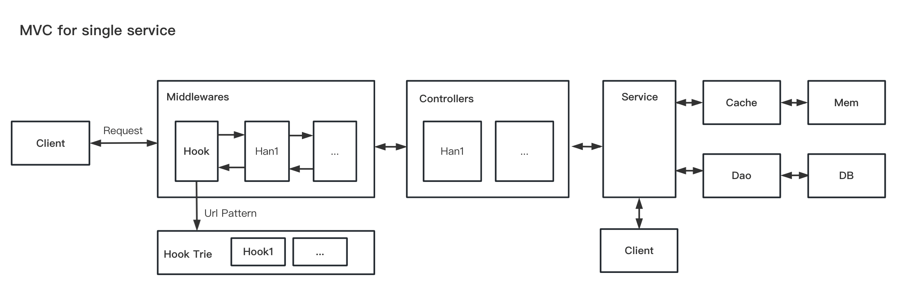

<p align="center">
    <a href="https://openkf.github.io/website" target="_blank">
        
    </a>
</p>
<h3 align="center" style="border-bottom: none">
    ⭐️  OpenKF(Open Knowledge Flow) is an online intelligent customer service system. ⭐️ <br>
<h3>

<p align=center>
<a href="https://goreportcard.com/report/github.com/OpenIMSDK/OpenKF"></a>
<a href="https://github.com/OpenIMSDK/OpenKF/issues?q=is%3Aissue+is%3Aopen+sort%3Aupdated-desc+label%3A%22good+first+issue%22"></a>
<a href="https://github.com/OpenIMSDK/OpenKF"></a>
<a href="https://join.slack.com/t/openimsdk/shared_invite/zt-1tmoj26uf-_FDy3dowVHBiGvLk9e5Xkg"></a>
<a href="https://github.com/OpenIMSDK/OpenKF/blob/main/LICENSE"></a>
<a href="https://golang.org/"></a>
</p>

</p>

<p align="center">
    <a href="./README.md"><b>English</b></a> •
    <a href="./README_zh-CN.md"><b>中文</b></a>
</p>

</p>
<br>


## 🧩 Awesome features

1. [OpenKF](https://github.com/OpenIMSDK/OpenKF) is an opensource customer service system based on [OpenIM](https://github.com/OpenIMSDK).
2. Support LLM(Local Knowledgebase) customer service.
3. Support multi-channel customer service, and easy to integrate with third-party systems.
4. Easy to deploy and secondary development.

## 📺 System Preview

<details open> 
    <summary>Login Page</summary>
    
</details>
<details> 
    <summary>Config Page</summary>
    
</details>
<details> 
    <summary>Dashboard Page</summary>
    
</details>
<details> 
    <summary>Platform Page</summary>
    
</details>
<details> 
    <summary>Session Page</summary>
    
</details>

## 🛫 Quick start 

> **Note**: You can get started quickly with OpenKF.

### 📦 Installation

```bash
git clone https://github.com/OpenIMSDK/OpenKF openkf && export openkf=$(pwd)/openkf && cd $openkf && make
```

### 🚀 Run

> **Note**: 
> We need to run the backend server first

```bash
make build
```

> open another terminal run the following command

```bash
# make dev
cd web
npm run dev
```

### 📖 Contributors get up to speed

Be good at using Makefile, it can ensure the quality of your project.

```bash
Usage: make <TARGETS> ...

Targets:
  all                          Build all the necessary targets. 🏗️
  build                        Build binaries by default. 🛠️
  go.build                     Build the binary file of the specified platform. 👨‍💻
  build-multiarch              Build binaries for multiple platforms. 🌍
  tidy                         tidy go.mod 📦
  style                        Code style -> fmt,vet,lint 🎨
  fmt                          Run go fmt against code. ✨
  vet                          Run go vet against code. 🔍
  generate                     Run go generate against code and docs. ✅
  lint                         Run go lint against code. 🔎
  test                         Run unit test ✔️
  cover                        Run unit test with coverage. 🧪
  docker-build                 Build docker image with the manager. 🐳
  docker-push                  Push docker image with the manager. 🔝
  docker-buildx-push           Push docker image with the manager using buildx. 🚢
  copyright-verify             Validate boilerplate headers for assign files. 📄
  copyright-add                Add the boilerplate headers for all files. 📝
  swagger                      Generate swagger document. 📚
  serve-swagger                Serve swagger spec and docs. 🌐
  clean                        Clean all builds. 🧹
  help                         Show this help info. ℹ️
```

> **Note**: 
> It's highly recommended that you run `make all` before committing your code. 🚀

```bash
make all
```


## 🕋 Architecture diagram



**MVC Architecture Design:**



## 🤖 File Directory Description

Catalog standardization design structure:

```bash
.
├── assets
│   └── images
├── build
├── deploy
├── docs
├── kf_plugins # Local knowledgebase with LLM
│   ├── chat
│   ├── config
│   ├── data
│   ├── logs
│   ├── model
│   └── utils
├── scripts
│   ├── githooks
│   └── LICENSE
├── server # OpenKF backend
│   ├── cmd
│   ├── data
│   ├── docs
│   ├── examples
│   ├── internal
│   ├── logs
│   ├── pkg
│   ├── test
│   └── tools
└── web # OpenKF frontend
    ├── public
    ├── scripts
    └── src
```

## 🗓️ community meeting

We want anyone to get involved in our community, we offer gifts and rewards, and we welcome you to join us every Thursday night.

Our conference is in the [OpenIM Slack](https://join.slack.com/t/openimsdk/shared_invite/zt-1tmoj26uf-_FDy3dowVHBiGvLk9e5Xkg) 🎯 `openkf` pipeline, then you can search the openkf pipeline to join

We take notes of each [biweekly meeting](https://github.com/orgs/OpenIMSDK/discussions/categories/meeting) in [GitHub discussions](https://github.com/OpenIMSDK/OpenKF/discussions/categories/meeting), and our minutes are written in [Google Docs](https://docs.google.com/document/d/1nx8MDpuG74NASx081JcCpxPgDITNTpIIos0DS6Vr9GU/edit?usp=sharing).


## 🤼‍ Contributing & Development

OpenIMSDK Our goal is to build a top-level open source community. We have a set of standards, in the [Community repository](https://github.com/OpenIMSDK/community).

If you'd like to contribute to this OpenKF repository, please read our [contributor documentation](https://github.com/OpenIMSDK/OpenKF/blob/main/CONTRIBUTING.md).

Before you start, please make sure your changes are in demand. The best for that is to create a [new discussion](https://github.com/OpenIMSDK/OpenKF/discussions/new/choose) OR [Slack Communication](https://join.slack.com/t/openimsdk/shared_invite/zt-1tmoj26uf-_FDy3dowVHBiGvLk9e5Xkg), or if you find an issue, [report it](https://github.com/OpenIMSDK/OpenKF/issues/new/choose) first.


## 🚨 License

OpenKF is licensed under the Apache 2.0 license. See [LICENSE](https://github.com/OpenIMSDK/OpenKF/tree/main/LICENSE) for the full license text.

The OpenKF logo, including its variations and animated versions, displayed in this repository [OpenKF](https://github.com/OpenIMSDK/openkf) under the [assets/logo](./assets/logo) and [assets/logo-gif](assets/logo-gif) directories, are protected by copyright laws.


## 🔮 Thanks to our contributors!

<a href="https://github.com/OpenIMSDK/OpenKF/graphs/contributors">
  
</a>
